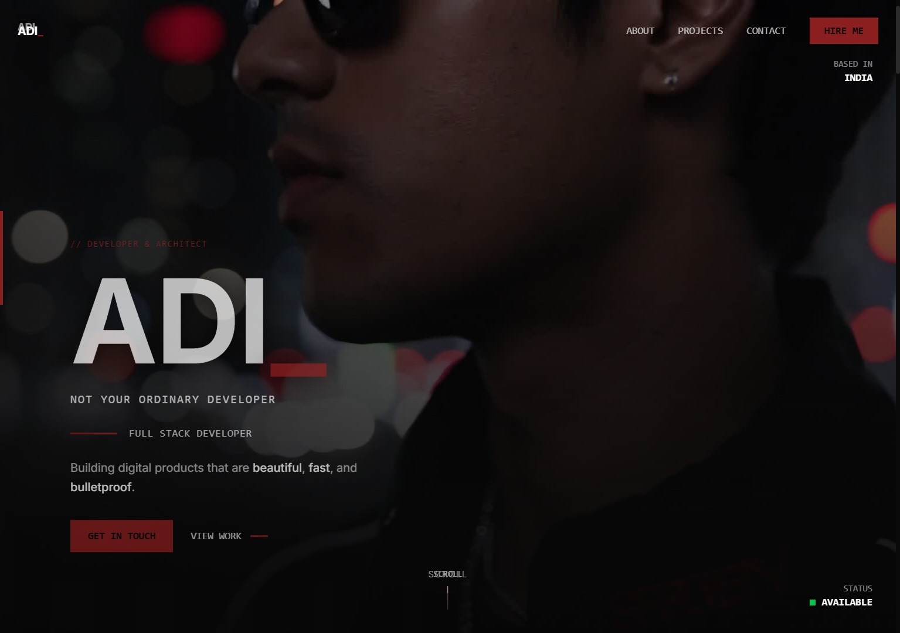

# Adi_ Portfolio

### "Not Your Ordinary Developer"

A high-performance, visually stunning portfolio built with a **Brutalist UI** aesthetic. This project combines advanced scroll-based animations with a clean, industrial design language to create a unique digital experience.



---

## 🚀 Tech Stack

- **Framework:** [Next.js 16 (App Router)](https://nextjs.org/)
- **Styling:** [Tailwind CSS 4](https://tailwindcss.com/)
- **Animations:** 
  - [GSAP](https://greensock.com/gsap/) (ScrollTrigger & Canvas Sequence)
  - [Framer Motion](https://www.framer.com/motion/) (UI Interactions)
  - [Lenis](https://lenis.darkroom.engineering/) (Smooth Scrolling)
- **Language:** [TypeScript](https://www.typescriptlang.org/)
- **UI Components:** [Magic UI](https://magicui.design/) (Customized)

---

## ✨ Key Features

### 1. Hero Scroll Sequence
A frame-by-frame canvas animation that responds to user scroll. It uses **GSAP ScrollTrigger** to render 164 optimized frames on a canvas, creating a cinematic entrance.

### 2. Brutalist Design System
A custom design language defined by:
- **Typography:** Bold monospace fonts (Space Mono / JetBrains Mono style).
- **Accents:** Sharp borders, industrial red accents (`#8B1E1E`), and underscore suffixes (`ABOUT_`, `PROJECTS_`).
- **HUD Elements:** Always-visible corner info (Location, Status) and a persistent glassmorphism header.

### 3. Bento Grid About Section
An asymmetrical grid layout inspired by modern dashboard design, featuring:
- **Animated Beam:** Connecting different areas of interest.
- **Dynamic Stats:** Project counts and experience metrics with SVG icons.
- **Grayscale Effects:** Hover-triggered color transitions for personal photography.

### 4. Project Showcase
A high-performance grid with category filtering. Each project card features optimized image loading with grayscale effects and detailed brutalist modals.

### 5. Responsive UX
- **Mobile Dock:** A macOS-inspired floating dock that appears only on mobile for quick navigation.
- **Desktop Header:** A persistent, clean navigation bar with scroll-triggered glassmorphism.

---

## 🛠️ How it's Built

### Canvas Animation
The `HeroScrollSequence` component preloads image frames and draws them to a `<canvas>` element. By using canvas instead of a video or multiple images, we achieve buttery smooth 60fps performance and avoid layout shifts.

### Design Tokens
Custom CSS variables in `globals.css` manage the brutalist theme, ensuring consistency across borders, background blurs, and the primary accent color.

### Component Architecture
The project follows an atomic structure:
- `@/components/magicui`: Low-level animation primitives.
- `@/components`: High-level layout sections (About, Projects, Contact).
- `@/data`: Centralized project data for easy updates.

---

## 🏁 Getting Started

1. **Clone the repo**
   ```bash
   git clone https://github.com/CodeAD17/portfolio.git
   ```

2. **Install dependencies**
   ```bash
   npm install
   ```

3. **Run the development server**
   ```bash
   npm run dev
   ```

4. **Build for production**
   ```bash
   npm run build
   ```

---

## 📄 License
This project is licensed under the MIT License - see the [LICENSE](LICENSE) file for details.

---

Built with precision by **Adi_** 💻